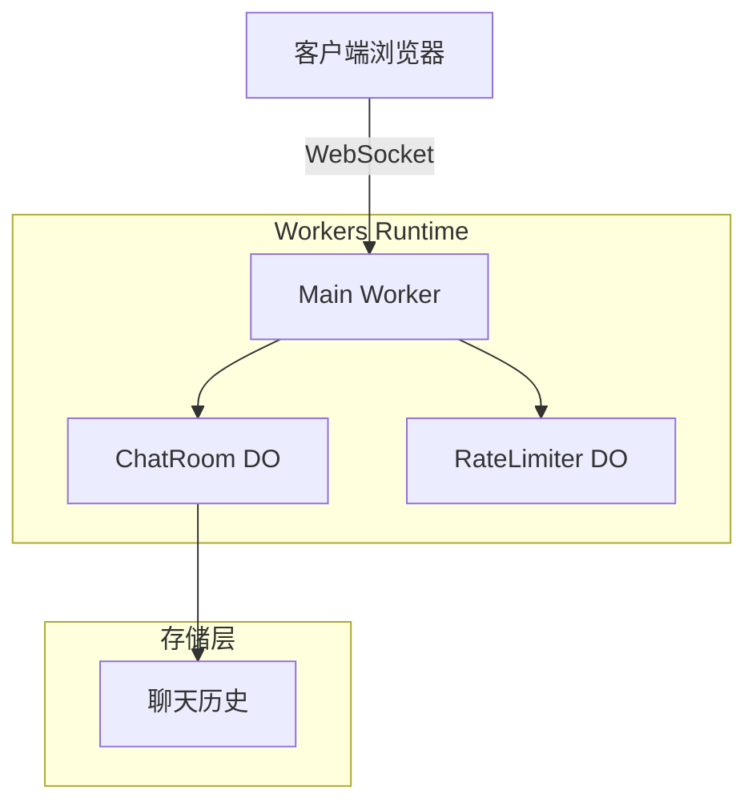

# Cloudflare Workers Chat Puzzle - 技术文档

## 项目概述

这是一个基于 Cloudflare Workers 和 Durable Objects 构建的实时聊天应用演示。该项目展示了如何在 Cloudflare 的边缘计算平台上实现有状态的实时应用，具有消息历史存储和全局速率限制功能。

## 项目架构

### 技术栈
- **运行时**: Cloudflare Workers (Edge Computing)
- **状态管理**: Durable Objects
- **通信协议**: WebSocket
- **数据格式**: JSON
- **模块系统**: ES Modules (.mjs)

### 核心组件



## 文件结构分析

```
workers-chat-puzzle/
├── src/
│   ├── chat.mjs          # 主要业务逻辑 (566行)
│   └── chat.html         # 前端UI界面 (482行)
├── wrangler.toml         # Cloudflare Workers配置
├── package.json          # 项目元信息
├── README.md            # 项目说明
└── LICENSE              # 许可证
```

## 核心代码分析

### 1. 主Worker (`src/chat.mjs`)

#### 请求路由
```javascript
export default {
  async fetch(request, env) {
    let url = new URL(request.url);
    let path = url.pathname.slice(1).split('/');

    if (!path[0]) {
      // 根路径返回HTML页面
      return new Response(HTML, {headers: {"Content-Type": "text/html;charset=UTF-8"}});
    }

    switch (path[0]) {
      case "api":
        return handleApiRequest(path.slice(1), request, env);
      default:
        return new Response("Not found", {status: 404});
    }
  }
}
```

#### API路由处理
- `POST /api/room` - 创建私有聊天室，返回唯一ID
- `/api/room/<room-id>/websocket` - 建立WebSocket连接

### 2. ChatRoom Durable Object

#### 核心特性
- **会话管理**: 跟踪所有WebSocket连接
- **消息广播**: 将消息实时发送给所有在线用户
- **历史存储**: 使用Durable Storage存储最近100条消息
- **WebSocket休眠**: 支持WebSocket Hibernation API

#### 关键方法

```javascript
export class ChatRoom {
  constructor(state, env) {
    this.state = state;
    this.storage = state.storage;
    this.sessions = new Map(); // 存储WebSocket会话
  }

  async handleSession(webSocket, ip) {
    // 1. 接受WebSocket连接
    this.state.acceptWebSocket(webSocket);
    
    // 2. 设置速率限制
    let limiterId = this.env.limiters.idFromName(ip);
    let limiter = new RateLimiterClient(...);
    
    // 3. 加载历史消息
    let storage = await this.storage.list({reverse: true, limit: 100});
  }

  async webSocketMessage(webSocket, msg) {
    // 1. 速率检查
    if (!session.limiter.checkLimit()) return;
    
    // 2. 消息处理和广播
    this.broadcast(dataStr);
    
    // 3. 持久化存储
    await this.storage.put(key, dataStr);
  }
}
```

### 3. RateLimiter Durable Object

#### 速率限制算法
- **策略**: 每5秒允许一个动作
- **宽限期**: 20秒宽限期，允许4-5次快速请求
- **全局性**: 跨所有聊天室的IP级限制

```javascript
export class RateLimiter {
  constructor(state, env) {
    this.nextAllowedTime = 0; // 下次允许时间
  }

  async fetch(request) {
    let now = Date.now() / 1000;
    this.nextAllowedTime = Math.max(now, this.nextAllowedTime);

    if (request.method == "POST") {
      this.nextAllowedTime += 5; // 每次动作增加5秒冷却
    }

    // 计算需要等待的时间
    let cooldown = Math.max(0, this.nextAllowedTime - now - 20);
    return new Response(cooldown);
  }
}
```

### 4. 前端界面 (`src/chat.html`)

#### UI组件
- **聊天日志区域** (`#chatlog`): 显示消息历史
- **用户列表** (`#roster`): 显示在线用户
- **输入框** (`#chat-input`): 消息输入
- **用户名表单** (`#name-form`): 设置用户名

#### WebSocket通信
```javascript
// 建立连接
ws = new WebSocket(url);

// 消息处理
ws.onmessage = function(event) {
  let data = JSON.parse(event.data);
  if (data.error) {
    // 错误处理
  } else if (data.joined) {
    // 用户加入
  } else if (data.quit) {
    // 用户离开
  } else if (data.message) {
    // 普通消息
  }
};

// 发送消息
ws.send(JSON.stringify({message: text}));
```

## 配置文件分析

### `wrangler.toml`
```toml
name = "edge-chat-puzzle"
compatibility_date = "2025-07-31"
main = "src/chat.mjs"

[durable_objects]
bindings = [
  { name = "rooms", class_name = "ChatRoom" },
  { name = "limiters", class_name = "RateLimiter" },
]

[[rules]]
type = "Data"
globs = ["**/*.html"]
fallthrough = false

[[migrations]]
tag = "v1"
new_sqlite_classes = ["ChatRoom", "RateLimiter"]
```

**关键配置说明:**
- `durable_objects.bindings`: 定义Durable Objects绑定
- `rules`: HTML文件作为数据资源上传
- `migrations`: 定义Durable Objects类的迁移

## 核心特性

### 1. 实时通信
- 使用WebSocket实现双向实时通信
- 支持WebSocket Hibernation API，降低资源消耗
- 消息广播到所有在线用户

### 2. 状态管理
- Durable Objects提供强一致性状态
- 每个聊天室一个独立的Durable Object实例
- 会话数据在内存中维护，支持休眠恢复

### 3. 消息持久化
- 使用Durable Storage存储聊天历史
- 按时间戳排序，支持倒序查询
- 新用户连接时自动加载最近100条消息

### 4. 速率限制
- 基于IP地址的全局速率限制
- 每个IP一个RateLimiter实例
- 支持突发请求的宽限期机制

### 5. 房间管理
- 支持公开房间（基于名称）和私有房间（基于ID）
- 房间ID长度限制和格式验证
- 自动房间创建和清理

## 部署和运行

### 环境要求
- Cloudflare Workers账户
- 启用Durable Objects功能
- Wrangler CLI工具

### 部署命令
```bash
# 登录Cloudflare
wrangler login

# 部署应用
wrangler deploy
```

### 环境绑定
应用需要以下环境绑定：
- `rooms`: ChatRoom Durable Object命名空间
- `limiters`: RateLimiter Durable Object命名空间

## 性能特性

### 扩展性
- **水平扩展**: 每个聊天室独立扩展
- **地理分布**: 在Cloudflare全球边缘节点运行
- **自动负载均衡**: 由Cloudflare平台处理

### 资源优化
- **WebSocket休眠**: 空闲连接不占用内存
- **按需创建**: Durable Objects按需实例化
- **边缘缓存**: 静态资源在边缘缓存

## 安全考虑

### 输入验证
- 用户名长度限制（32字符）
- 消息长度限制（256字符）
- 房间名称格式验证

### 速率限制
- 基于IP的消息频率限制
- 防止垃圾消息和DDoS攻击
- 全局速率限制策略

### 错误处理
- 完善的异常捕获和处理
- WebSocket错误恢复机制
- 客户端友好的错误消息

## 技术创新点

### 1. 模块化架构
- 使用ES Modules语法
- 可组合的Worker架构
- 导出处理函数而非事件监听

### 2. WebSocket Hibernation
- 降低内存占用
- 提高连接并发数
- 保持连接状态

### 3. 边缘计算
- 全球分布式部署
- 低延迟访问
- 无服务器架构

## 总结

这个项目是一个优秀的Cloudflare Workers和Durable Objects技术演示，展示了如何在边缘计算环境中构建有状态的实时应用。代码结构清晰，注释详细，是学习现代无服务器架构和边缘计算的excellent示例。

主要技术亮点：
- **边缘原生**: 100%运行在Cloudflare边缘
- **状态管理**: Durable Objects提供强一致性
- **实时通信**: WebSocket + Hibernation API
- **全局扩展**: 自动地理分布和负载均衡
- **简洁架构**: 几百行代码实现完整功能